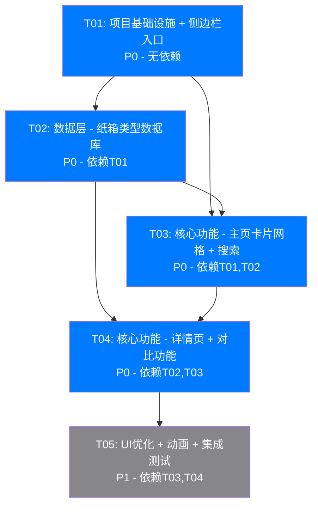

# Carton-Wiki模块系统架构设计文档

> **文档版本**: v1.0  
> **创建日期**: 2025-01-18  
> **架构师**: Bob (软件架构师)  
> **对应PRD**: Carton-Wiki模块产品需求文档

---

## Part A: 系统设计方案

### 1. Implementation Approach (实现方案)

#### 1.1 核心技术挑战分析

根据PRD需求，本模块面临以下技术挑战：

1. **数据密度高**: 15种纸箱类型，每种包含展开图、应用场景、优缺点、成本、设备、瓦楞类型等9个维度对比参数
2. **搜索性能**: 需要实时搜索功能，对15种类型进行多字段模糊匹配，要求debounce 300ms优化
3. **对比功能**: 需要支持2-4种类型的表格对比，涉及数据提取和动态表格生成
4. **响应式布局**: 支持320px-2560px宽度，需要精细的CSS媒体查询设计
5. **代码规范性**: 必须严格遵循现有系统的编码规范（var、字符串拼接、传统function）

#### 1.2 技术选型与理由

| 技术要素 | 选型方案 | 选型理由 |
|---------|---------|---------|
| **前端框架** | 纯HTML + CSS + JavaScript | PRD明确要求与现有系统一致，无需框架依赖 |
| **数据管理** | 独立JS数据文件 + sessionStorage | 数据静态存储，状态用sessionStorage持久化 |
| **路由模式** | Router.renderXxx() 单页应用 | 与现有系统架构保持一致 |
| **UI框架** | 自定义CSS（苹果风格） | 浅灰背景#F5F5F7、蓝色强调色#007AFF、深灰文字#1D1D1F |
| **搜索实现** | 原生JavaScript + debounce | 轻量级，无需引入lodash等库 |
| **对比功能** | 动态表格生成 | 基于DOM操作动态渲染对比表格 |

#### 1.3 架构模式

采用 **单页应用（SPA）+ 模块化** 架构：

```
表现层: HTML + CSS (苹果风格UI)
    ↓
逻辑层: JavaScript (Router路由 + Wiki模块逻辑)
    ↓
数据层: carton-wiki-data.js (静态数据文件)
```

**设计原则**：
- **兼容性优先**: 使用`var`声明、`字符串拼接`、`传统function`
- **模块化**: 数据与逻辑分离，便于维护
- **性能优化**: debounce搜索、按需加载详情页
- **可扩展性**: 数据结构支持后续增加纸箱类型

---

### 2. File List (文件列表)

以下是需要创建或修改的文件列表（相对路径）：

#### 2.1 现有文件（需修改）

| 文件路径 | 修改内容 | 优先级 |
|---------|---------|-------|
| `index.html` | 1. 侧边栏添加"纸箱Wiki"入口（在"纸箱计算"之后）<br>2. 添加Wiki模块的HTML容器 | P0 |
| `css/style.css` | 1. 添加Wiki模块样式<br>2. 卡片网格样式<br>3. 详情页样式<br>4. 对比表格样式<br>5. 搜索框样式<br>6. 响应式媒体查询 | P0 |
| `js/app.js` | 1. 添加Wiki路由配置<br>2. 添加路由跳转逻辑 | P0 |

#### 2.2 新创建文件

| 文件路径 | 功能描述 | 优先级 |
|---------|---------|-------|
| `js/carton-wiki-data.js` | 纸箱类型数据库（15种类型的完整数据） | P0 |
| `js/carton-wiki.js` | Wiki模块核心逻辑（搜索、详情、对比、渲染） | P0 |
| `docs/system_design.md` | 系统架构设计文档 | P0 |
| `docs/sequence-diagram.mermaid` | 程序调用流程图（Mermaid） | P1 |
| `docs/class-diagram.mermaid` | 数据结构和接口图（Mermaid） | P1 |

#### 2.3 文件依赖关系

```
index.html
    ↓ (引用)
css/style.css
js/app.js ←→ js/carton-wiki.js ←→ js/carton-wiki-data.js
```

---

### 3. Data Structures and Interfaces (数据结构和接口)

#### 3.1 数据类型定义（JavaScript对象结构）

根据PRD要求，每种纸箱类型包含以下数据结构：

```javascript
// 纸箱类型数据对象结构
var CartonType = {
    // 基础信息
    code: "",             // 标准代码（如 "RSC"）
    nameEn: "",           // 英文名称
    nameCn: "",           // 中文名称
    popularity: 0,        // 市场占比（百分比，如 60）
    
    // 结构信息
    asciiArt: "",         // ASCII art展开图
    structure: "",        // 结构特点描述
    
    // 应用信息
    applications: [],     // 应用场景（数组，3-4个字符串）
    
    // 评价信息
    pros: [],             // 优点（数组，3-4个字符串）
    cons: [],             // 缺点（数组，2-3个字符串）
    
    // 生产信息
    costLevel: 0,         // 制作成本估算（1-5级）
    equipment: [],        // 所需生产设备（数组）
    fluteTypes: [],       // 适用瓦楞纸板类型（数组）
    layers: [],           // 适用瓦楞层数（数组）
    
    // 对比维度参数（9个维度）
    comparisonParams: {
        protection: 0,    // 保护性（1-5）
        stackability: 0,  // 堆码性（1-5）
        printability: 0,  // 印刷性（1-5）
        assemblyEase: 0,  // 组装难度（1-5，5=最易）
        storageEfficiency: 0, // 仓储效率（1-5）
        costEfficiency: 0, // 成本效率（1-5）
        automation: 0,    // 自动化适配（1-5）
        sustainability: 0, // 可持续性（1-5）
        customization: 0   // 定制化（1-5）
    }
};
```

#### 3.2 全局数据结构

```javascript
// 纸箱类型数据库（数组）
var cartonTypes = [
    // 15种纸箱类型对象
];

// 当前搜索关键词
var currentSearchKeyword = "";

// 当前对比列表（2-4种类型代码）
var comparisonList = [];

// 当前查看的纸箱类型代码
var currentCartonCode = "";
```

#### 3.3 核心函数接口

```javascript
// ========== Router接口 ==========
function renderWikiHome()           // 渲染Wiki主页（卡片网格）
function renderWikiDetail(code)     // 渲染Wiki详情页
function renderWikiCompare()        // 渲染对比页面

// ========== 搜索接口 ==========
function handleSearchInput(keyword) // 处理搜索输入（带debounce）
function performSearch(keyword)     // 执行搜索
function clearSearch()              // 清除搜索

// ========== 对比接口 ==========
function addToComparison(code)      // 添加到对比列表
function removeFromComparison(code) // 从对比列表移除
function renderComparisonTable()    // 渲染对比表格

// ========== 渲染接口 ==========
function renderCartonCards(types)   // 渲染纸箱卡片
function renderCartonDetail(type)   // 渲染纸箱详情
function renderSearchResults(types) // 渲染搜索结果

// ========== 事件处理接口 ==========
function handleCardClick(code)      // 卡片点击事件
function handleCompareClick(code)   // 对比按钮点击事件
function handleBackToList()         // 返回列表事件
```

#### 3.4 Mermaid 类图

请参考 `docs/class-diagram.mermaid` 文件中的完整类图。

---

### 4. Program Call Flow (程序调用流程)

请参考 `docs/sequence-diagram.mermaid` 文件中的完整时序图。

关键流程包括：
1. 用户访问Wiki主页流程
2. 搜索功能流程
3. 查看详情页流程
4. 对比功能流程
5. 初始化流程

---

### 5. Anything UNCLEAR (待明确事项)

#### 5.1 需要用户确认的问题

| 序号 | 问题 | 影响范围 | 建议方案 |
|-----|------|---------|---------|
| 1 | **ASCII art展开图的具体样式**：PRD中提到"PRD中已有"，但未提供具体ASCII art内容。是否需要我根据每种纸箱类型设计ASCII art？ | 数据文件、详情页渲染 | 架构师根据FEFCO标准设计15种纸箱的ASCII art（约10-15行字符 each） |
| 2 | **搜索匹配的具体字段**：是只匹配code、nameEn、nameCn，还是需要匹配applications、pros等所有文本字段？ | 搜索功能实现 | 建议：匹配code、nameEn、nameCn、applications（模糊匹配） |
| 3 | **对比表格的交互细节**：对比表格是否需要支持"导出为图片/PDF"功能？PRD未明确说明。 | 对比功能实现 | 建议：P0不包含导出功能，P1可考虑添加 |
| 4 | **数据准确性验证**：PRD提到"参考FEFCO代码系统、ASTM D4727、GB/T 6543-2008"，但是否需要架构师验证所有15种类型的参数准确性？ | 数据文件 | 建议：架构师根据标准设计初版数据，后续由领域专家审核 |
| 5 | **sessionStorage持久化细节**：对比列表(comparisonList)是否需要跨页面持久化？用户关闭浏览器后是否保留？ | 状态管理 | 建议：使用sessionStorage（关闭标签页后清除），符合临时对比场景 |
| 6 | **侧边栏入口的具体位置**：PRD说"在'纸箱计算'之后"，但是否需要提供图标？图标使用文字还是图片？ | UI实现 | 建议：与现有侧边栏风格一致，使用文字+emoji（📚 纸箱Wiki） |
| 7 | **响应式断点具体数值**：PRD提到"桌面4列、平板2列、手机1列"，但具体断点值（px）未明确。 | CSS实现 | 建议：桌面≥1024px(4列)，平板600-1023px(2列)，手机<600px(1列) |

#### 5.2 假设和约束

1. **兼容性假设**：现有系统使用`var`、`字符串拼接`、`传统function`，本模块严格遵循此规范
2. **性能假设**：15种纸箱类型数据量小（约50KB），无需分页或虚拟滚动
3. **安全假设**：纯前端应用，无后端API，不涉及用户认证、权限管理
4. **浏览器支持**：支持现代浏览器（Chrome、Firefox、Safari、Edge），不兼容IE

---

## Part B: Task Decomposition (任务分解)

### 6. Required Packages (依赖包列表)

本项目为**纯HTML + CSS + JavaScript**应用，无需安装任何第三方依赖包。

```
# 无第三方依赖包
# 所有功能使用原生JavaScript实现
```

**说明**：
- ✅ 搜索debounce：使用原生`setTimeout` + `clearTimeout`实现
- ✅ DOM操作：使用原生`document.createElement` + `appendChild`实现
- ✅ 事件绑定：使用原生`addEventListener`实现
- ✅ 样式：使用原生CSS实现，无需Sass/Less

---

### 7. Task List (任务列表，按依赖关系排序)

根据**任务分解规则（HARD LIMITS）**：
- ✅ 最大任务数：**5个任务**（硬性上限）
- ✅ 最小粒度：每个任务至少包含3个相关文件
- ✅ 分组原则：按功能模块/层次分组
- ✅ 第一个任务：项目基础设施（配置文件+入口文件+依赖声明）

#### **T01: 项目基础设施 + 侧边栏入口** ⭐ [P0]

**任务描述**：搭建Wiki模块的基础架构，包括修改现有文件添加侧边栏入口、路由配置、基础HTML容器。

**源文件**：
- `index.html` - 添加侧边栏"纸箱Wiki"入口（在"纸箱计算"之后）、添加Wiki模块HTML容器
- `js/app.js` - 添加Wiki路由配置（`/wiki`、`/wiki/detail/:code`、`/wiki/compare`）
- `css/style.css` - 添加Wiki模块基础样式变量（CSS自定义属性）

**依赖任务**：无（第一个任务）

**优先级**：P0

**验收标准**：
- [ ] 侧边栏显示"📚 纸箱Wiki"入口
- [ ] 点击入口后URL变更为`/wiki`
- [ ] 页面显示Wiki模块的基础容器（空白）

---

#### **T02: 数据层 - 纸箱类型数据库** ⭐ [P0]

**任务描述**：创建纸箱类型数据库文件，包含15种纸箱类型的完整数据（ASCII art、应用场景、优缺点、成本、设备、瓦楞类型、9个对比维度参数）。

**源文件**：
- `js/carton-wiki-data.js` - 完整数据文件（15种纸箱类型，每种包含全部字段）
- `docs/carton-type-research.md` - 数据来源说明（FEFCO、ASTM、GB/T标准引用）
- `js/carton-wiki-data-test.js` - 数据验证脚本（可选，用于验证数据完整性）

**依赖任务**：T01（需要确认数据字段与T01中Router渲染逻辑匹配）

**优先级**：P0

**验收标准**：
- [ ] `cartonTypes`数组包含15种类型
- [ ] 每种类型包含全部必需字段（code、nameEn、nameCn、asciiArt、applications、pros、cons、costLevel、equipment、fluteTypes、layers、comparisonParams）
- [ ] 数据可被正确读取（在浏览器Console中执行`console.log(cartonTypes)`可看到数据）

---

#### **T03: 核心功能 - 主页卡片网格 + 搜索** ⭐ [P0]

**任务描述**：实现Wiki主页的卡片网格展示和实时搜索功能。

**源文件**：
- `js/carton-wiki.js` - 添加`renderWikiHome()`、`renderCartonCards()`、`handleSearchInput()`、`performSearch()`函数
- `css/style.css` - 添加卡片网格样式（桌面4列、平板2列、手机1列）、搜索框样式、响应式媒体查询
- `index.html` - 添加搜索框HTML结构

**依赖任务**：T01（Router渲染）、T02（数据读取）

**优先级**：P0

**验收标准**：
- [ ] 主页显示15种纸箱类型的卡片网格
- [ ] 卡片包含：图标、代码、中英文名称、市场占比
- [ ] 搜索框输入关键词后300ms自动显示搜索结果
- [ ] 搜索匹配code、nameEn、nameCn、applications字段
- [ ] 响应式布局：调整浏览器窗口大小，卡片列数自动调整

---

#### **T04: 核心功能 - 详情页 + 对比功能** ⭐ [P0]

**任务描述**：实现纸箱类型详情页展示和对比功能（添加对比、查看对比、对比表格）。

**源文件**：
- `js/carton-wiki.js` - 添加`renderWikiDetail()`、`renderWikiCompare()`、`addToComparison()`、`removeFromComparison()`、`renderComparisonTable()`函数
- `css/style.css` - 添加详情页样式（ASCII art展示区、信息分区）、对比表格样式
- `js/carton-wiki.js` (sessionStorage部分) - 添加对比列表的sessionStorage持久化逻辑

**依赖任务**：T02（数据读取）、T03（卡片点击事件）

**优先级**：P0

**验收标准**：
- [ ] 点击卡片进入详情页，显示：ASCII展开图、应用场景、优缺点、成本、设备、瓦楞类型
- [ ] 详情页显示"添加到对比"按钮，点击后提示"已添加"
- [ ] 对比列表包含2-4种类型，超过4种提示"最多对比4种"
- [ ] 点击"查看对比"显示对比表格，包含9个维度参数
- [ ] 对比表格支持"移除"操作

---

#### **T05: UI优化 + 动画 + 集成测试** ⭐ [P1]

**任务描述**：优化UI细节（苹果风格）、添加过渡动画、进行全模块集成测试。

**源文件**：
- `css/style.css` - 优化苹果风格样式（圆角、阴影、颜色）、添加0.3s ease过渡动画
- `js/carton-wiki.js` - 添加页面切换动画、卡片hover效果
- `docs/system_design.md` - 更新最终版架构设计文档

**依赖任务**：T03（主页）、T04（详情页+对比）

**优先级**：P1

**验收标准**：
- [ ] 所有页面元素符合苹果风格（浅灰#F5F5F7背景、蓝色#007AFF强调色、深灰#1D1D1F文字、圆角、阴影）
- [ ] 卡片hover有放大效果（transform: scale(1.05)）
- [ ] 页面切换有0.3s ease过渡动画
- [ ] 全模块测试：侧边栏入口→主页→搜索→详情页→添加对比→查看对比，全流程无报错

---

### 8. Shared Knowledge (共享知识/跨文件约定)

#### 8.1 编码规范（与现有系统保持一致）

| 规范项 | ✅ 必须遵守 | ❌ 禁止使用 |
|-------|-----------|-----------|
| 变量声明 | `var variableName = value;` | `const`、`let` |
| 字符串拼接 | `"string" + variable + "string"` | 模板字符串 `` `string${variable}string` `` |
| 函数定义 | `function functionName() {}` | 箭头函数 `() => {}` |
| 对象属性访问 | `object.property` 或 `object["property"]` | 可选链 `object?.property` |
| 数组/对象展开 | `array.concat(otherArray)` | 展开运算符 `...array` |
| 默认参数 | `var param = param \|\| defaultValue;` | `function(param = defaultValue)` |

#### 8.2 命名规范

| 类型 | 命名规则 | 示例 |
|-----|---------|------|
| 全局变量 | camelCase | `var cartonTypes = [];` |
| 函数 | camelCase | `function renderWikiHome() {}` |
| CSS类名 | kebab-case | `.wiki-card`, `.wiki-detail` |
| CSS ID | kebab-case | `#wiki-container` |
| 数据对象属性 | camelCase | `cartonType.code`, `cartonType.nameEn` |
| 文件路径 | kebab-case | `carton-wiki-data.js`, `carton-wiki.js` |

#### 8.3 CSS自定义属性约定

```css
:root {
    /* 苹果风格配色 */
    --color-background: #F5F5F7;
    --color-primary: #007AFF;
    --color-text-primary: #1D1D1F;
    --color-text-secondary: #86868B;
    --color-border: #D2D2D7;
    --color-card-background: #FFFFFF;
    
    /* 阴影 */
    --shadow-card: 0 2px 8px rgba(0, 0, 0, 0.08);
    --shadow-card-hover: 0 4px 16px rgba(0, 0, 0, 0.12);
    
    /* 圆角 */
    --radius-card: 12px;
    --radius-button: 8px;
    
    /* 过渡 */
    --transition-default: all 0.3s ease;
}
```

#### 8.4 Router路由约定

**路由配置**（在`js/app.js`中添加）：

```javascript
// Wiki模块路由
{
    path: "/wiki",
    render: function() {
        renderWikiHome();
    }
},
{
    path: "/wiki/detail/:code",
    render: function(params) {
        renderWikiDetail(params.code);
    }
},
{
    path: "/wiki/compare",
    render: function() {
        renderWikiCompare();
    }
}
```

#### 8.5 搜索功能约定

**debounce实现**（原生JavaScript）：

```javascript
function handleSearchInput(keyword) {
    // 清除之前的计时器
    if (searchDebounceTimer) {
        clearTimeout(searchDebounceTimer);
    }
    
    // 设置新的计时器
    searchDebounceTimer = setTimeout(function() {
        performSearch(keyword);
    }, 300);
}
```

**搜索匹配逻辑**：

```javascript
function performSearch(keyword) {
    var results = [];
    var keywordLower = keyword.toLowerCase();
    
    for (var i = 0; i < cartonTypes.length; i++) {
        var type = cartonTypes[i];
        var matchCode = type.code.toLowerCase().indexOf(keywordLower) !== -1;
        var matchNameEn = type.nameEn.toLowerCase().indexOf(keywordLower) !== -1;
        var matchNameCn = type.nameCn.indexOf(keyword) !== -1;
        var matchApplications = false;
        
        // 匹配应用场景
        for (var j = 0; j < type.applications.length; j++) {
            if (type.applications[j].indexOf(keyword) !== -1) {
                matchApplications = true;
                break;
            }
        }
        
        if (matchCode || matchNameEn || matchNameCn || matchApplications) {
            results.push(type);
        }
    }
    
    renderSearchResults(results);
}
```

#### 8.6 对比功能约定

**对比列表管理**：

```javascript
function addToComparison(code) {
    // 检查是否已存在
    if (comparisonList.indexOf(code) !== -1) {
        alert("该类型已在对比列表中");
        return;
    }
    
    // 检查数量限制
    if (comparisonList.length >= 4) {
        alert("最多对比4种类型");
        return;
    }
    
    // 添加到列表
    comparisonList.push(code);
    
    // 持久化到sessionStorage
    sessionStorage.setItem("wikiComparisonList", JSON.stringify(comparisonList));
    
    alert("已添加到对比列表");
}

function removeFromComparison(code) {
    var index = comparisonList.indexOf(code);
    if (index !== -1) {
        comparisonList.splice(index, 1);
        sessionStorage.setItem("wikiComparisonList", JSON.stringify(comparisonList));
    }
}
```

#### 8.7 HTML结构约定

**Wiki模块主容器**（在`index.html`中添加）：

```html
<!-- 纸箱Wiki模块 -->
<div id="wiki-container" class="wiki-container" style="display: none;">
    <!-- 搜索框 -->
    <div class="wiki-search">
        <input type="text" id="wiki-search-input" placeholder="搜索纸箱类型..." />
    </div>
    
    <!-- 卡片网格容器 -->
    <div id="wiki-card-grid" class="wiki-card-grid">
        <!-- 卡片动态生成 -->
    </div>
    
    <!-- 详情页容器 -->
    <div id="wiki-detail" class="wiki-detail" style="display: none;">
        <!-- 详情页动态生成 -->
    </div>
    
    <!-- 对比页容器 -->
    <div id="wiki-compare" class="wiki-compare" style="display: none;">
        <!-- 对比表格动态生成 -->
    </div>
</div>
```

---

### 9. Task Dependency Graph (任务依赖图)



**依赖说明**：
- **T01（基础设施）**：无依赖，第一个任务，必须最先完成
- **T02（数据层）**：依赖T01，因为需要确认Router渲染逻辑与数据字段匹配
- **T03（主页+搜索）**：依赖T01（Router渲染）和T02（数据读取）
- **T04（详情页+对比）**：依赖T02（数据读取）和T03（卡片点击事件）
- **T05（UI优化）**：依赖T03和T04，需要核心功能完成后才能优化

**关键路径**：T01 → T02 → T03 → T04 → T05（总工期取决于各环节完成速度）

---

## Appendix A: 纸箱类型数据示例

以下是**RSC（常规开槽纸箱）**的完整数据示例，供开发参考：

```javascript
{
    code: "RSC",
    nameEn: "Regular Slotted Container",
    nameCn: "常规开槽纸箱",
    popularity: 60,
    
    asciiArt: "┌─────────────────────────────┐\n" +
              "│                             │\n" +
              "│  ┌─────┐         ┌─────┐  │\n" +
              "│  │     │         │     │  │\n" +
              "│  └─────┘         └─────┘  │\n" +
              "│                             │\n" +
              "└─────────────────────────────┘\n" +
              "  ┌─────┐         ┌─────┐\n" +
              "  │     │         │     │\n" +
              "  └─────┘         └─────┘",
    
    structure: "所有襟片长度相同，襟片接合器在中央接合",
    
    applications: [
        "电子产品包装",
        "食品包装",
        "日用品包装",
        "物流运输"
    ],
    
    pros: [
        "结构简单，成本低",
        "生产效率高",
        "堆叠稳定性好",
        "适用范围广"
    ],
    
    cons: [
        "对内装物保护有限",
        "需要填充物固定产品"
    ],
    
    costLevel: 2,
    equipment: ["印刷机", "开槽机", "粘合机"],
    fluteTypes: ["A楞", "B楞", "C楞", "E楞"],
    layers: ["3层", "5层"],
    
    comparisonParams: {
        protection: 3,
        stackability: 4,
        printability: 4,
        assemblyEase: 5,
        storageEfficiency: 4,
        costEfficiency: 5,
        automation: 5,
        sustainability: 4,
        customization: 2
    }
}
```

---

## Appendix B: 浏览器兼容性测试清单

| 浏览器 | 最低版本 | 测试项目 |
|-------|---------|---------|
| Chrome | 90+ | 卡片网格、搜索、详情页、对比表格 |
| Firefox | 88+ | 卡片网格、搜索、详情页、对比表格 |
| Safari | 14+ | 卡片网格、搜索、详情页、对比表格 |
| Edge | 90+ | 卡片网格、搜索、详情页、对比表格 |

**注意**：不支持IE 11及以下版本（使用ES5语法但CSS Grid可能需要polyfill）

---

## Document History

| 版本 | 日期 | 修改内容 | 修改人 |
|-----|------|---------|-------|
| v1.0 | 2025-01-18 | 初始版本，完整架构设计 | Bob（架构师） |

---

**文档结束**

---

## 下一步行动

1. **产品经理人（Alice）**：审核PRD中的纸箱类型数据是否准确，特别是ASCII art展开图和对比维度参数
2. **团队负责人（主理人）**：审核架构设计文档，确认任务分解是否合理
3. **工程师（Charlie）**：等待T01-T05任务分配，按照编码规范进行开发

---

**架构师签名**：Bob  
**日期**：2025-01-18
